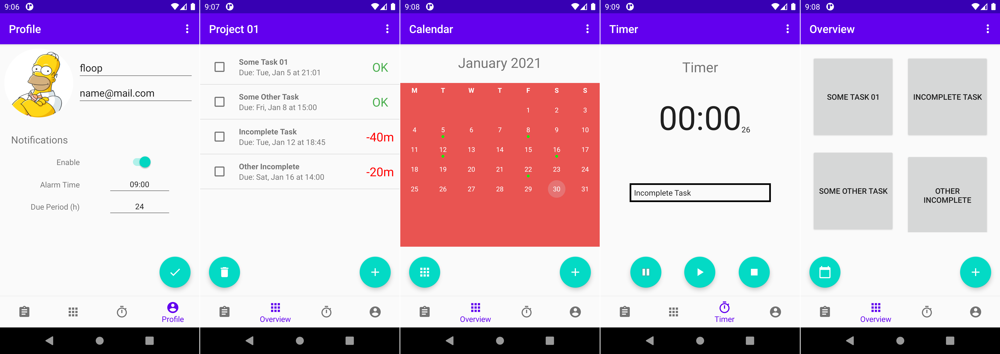

# docket-app
COMP3004 Android Group Project

Docket is a Task Management app that helps you plan out which tasks should be completed in order of priority. All data is backed up in the cloud using Firebase, supporting real-time updates between multiple devices.

Created by:
- Filipp Gorodkov
- Michael Balcerzak
- Matthew Nitschke
- Matteo Filia